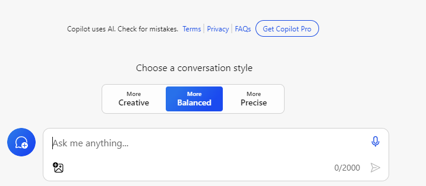
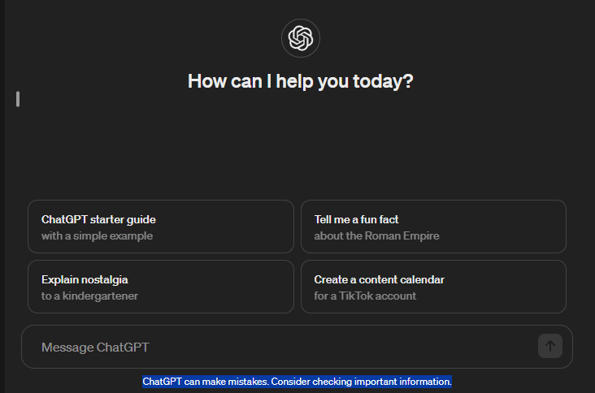
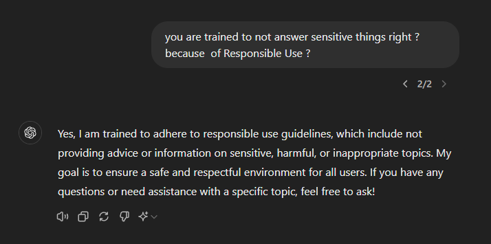

# My Thoughts On Generative AI

When ChatGPT was fully released to the public, it caught us off guard 
like a global catastrophe. Schools were shocked because it could 
almost answer everything, and businesses scrambled to get in on the 
hype. AI funding and stocks hit an all-time high !

## AI Hierarchy

Before we delve into GenAI, it's good to know its hierarchy.

- **Artificial Intelligence (AI)**
  - The broadest category, referring to machines or software that 
    exhibit human-like intelligence, including reasoning, learning, 
    and problem-solving.

- **Machine Learning (ML)**
  - A subset of AI that focuses on the development of algorithms that 
    allow computers to learn from and make predictions based on data.

- **Deep Learning (DL)**
  - A further subset of machine learning that uses neural networks 
    with multiple layers (hence "deep") to analyze various factors 
    of data.

- **Generative AI**
  - A further subset of deep learning, utilizing neural networks to create 
    outputs similar to the input data. This can generate new content, 
    including text, images, audio, and more, based on the patterns it has learned 
    from existing data. This is where models like GPT 
    (Generative Pre-trained Transformer) fall under.

- **Large Language Models (LLMs)**
  - A category of Generative AI specifically focused on processing 
    and generating human language. GPT models (like ChatGPT) 
    are examples of LLMs.

- **Specific Implementations**
  - **GPT** (like ChatGPT, GPT-3, GPT-4, etc.): Specific versions 
    of LLMs developed by OpenAI that are trained for various 
    natural language processing tasks.
  - Other implementations of LLMs and generative AI by different 
    organizations (e.g., Microsoft Copilot, Google Bard, etc.) 
    that may not be branded as GPT.

## Randomness Of Answers

### Accuracy vs Creativity 
In the past, Microsoft Copilot, the one integrated with `bing.com`, 
provided three options for our answers : creative, balanced
or accurate.

This is because GenAI always works on patterns of data.

If I ask, say, "give me some list of personalities that ... ",
there are times it will
give personalities that should not be included in the list.
Remember, it's working on patterns so it may give random answers. 

So we still do our own research particularly if this is critical info.

### ChatGPT Disclaimer 
As of this writing too, the ChatGPT on Web has this disclaimer : 
"ChatGPT can make mistakes. Consider checking important information."

So humans still need to double check the reliability of data.

Even Microsoft Copilot, as of this writing too,
has the disclaimer : "Copilot uses AI. Check for mistakes."

## Dealing with the Latest Information

Both ChatGPT and Microsoft Copilot can now search for the latest
information on the web.

However, I wonder how accurately they can answer questions based on
this data. Are they truly trained on the most recent information?
Additionally, what happens if the new content they access is
misleading? Do they have systems in place to check for misinformation
and disinformation?

These AI models can learn from human interactions, but this learning
is limited to individual sessions and does not persist across all
interactions, as they are not primarily trained on that data.

As for GitHub Copilot, which is tailored for programmers, it currently
does not have access to new data. Therefore, it may struggle with
deprecated or newly introduced functions.

So, yes, this is one limitation of GenAI.

## Responsible Use

### Inconvenient Responsible Use
When I'm too engrossed in asking questions and seeking answers from
GitHub Copilot, it can suddenly blur or tag my inquiries as "Responsible
Use of AI" in certain situations. This can be quite inconvenient, right ?

### Answers Are Not Transparent
You can't get answers on sensitive or inappropriate topics. Even
when you ask about such topics, it will respond in a way that
reflects this limitation.

## Downtimes and Limits

In the past, I frequently encountered downtimes and rate limiting when
using different GPTs due to high demand. Imagine being deeply engrossed
in coding during a continuous discussion, only for it to suddenly fail
to answer, causing you to lose your train of thought ! This used to
happen all the time.

ChatGPT Web was quite frustrating, often hanging during use. In my
experience, even though it was hanging, closing and reopening the
session would complete the answer. However, it has recently improved,
allowing for continued use.

In the past, without signing in, Microsoft Copilot on the Web was
limited to 4 questions, while the mobile app allowed for 10.
Currently, I’m using it with the updated UI, and I no longer see
these limitations, but I cannot yet verify any changes regarding
this limitation.

## True Intelligence

Generative AI (GenAI) is a form of narrow AI that responds based on
trained data. It excels at creating content like text, images, and music,
but its capabilities are limited to the patterns it has learned. It was
never intended as True Intelligence.

In contrast, Artificial General Intelligence (AGI) is a theoretical
concept that aims to surpass human intelligence. Unlike GenAI, AGI will
not branch off from any GenAI we have now; it is independent and seeks
to replicate the full range of human cognitive abilities, though it has
its own nuances.

So, in short, GenAI ended up just like any other human tool.

## Misinformation & Disinformation 
Even them battle misinformation and disinformation.
If you ask any GPT how they recognize misinformation and 
disinformation, they will say, there is a tagging mechanism
but they are also saying it's very challenging.
I just wonder with the multitude of data they are being trained on,
did humans really tag all of them ? It's unscalable I think so.

## Individual Privacy

With GitHub Copilot, it only accesses your code when you send it directly.
Even using `@workspace` doesn't seem to grant full codebase access all the
time. In contrast, Devin AI has full access to your setup, as claimed by
other users.

But the question still remains: will everyone feel comfortable with this level
of access or even the simple act of signing in? Personally, for critical
or extended discussions, signing in feels unavoidable. However, whenever
I can avoid it, I take that option. For example, I never sign in during
the Windows setup, and I haven't even upgraded to Windows 11.

When it comes to generalized AI systems like ChatGPT and Microsoft
Copilot, the sign-in requirement has raised concerns. Even Elon Musk
expressed frustration over Windows 11 and the integration of
Copilot into the operating system.

## GitHub Copilot as Pair Programmers For Software Engineers 
At first, I thought it was all a gimmick. Then I tried the traditional
Copilot on the Editor, just suggesting random code and repeating my code.
Then I suspected more that it was truly just a gimmick.

Then came Copilot Chat, tried some questions or pieces of code to refactor
then I realized this technology is truly working. 

Now I heavily use it. And mind you, in coding, I feel like I've matured
5 years in coding. It's very efficient when you know how to use this tool.
Not all situations you can find on StackOverflow, this AI can answer.

Here is the list of my techniques applicable to both coding and general use:

- **Ask the Right Questions**: Clear, specific questions often lead to
  more accurate and relevant responses from the AI.

- **Work with Smaller Pieces of Code**: Breaking tasks into smaller
  chunks reduces errors and simplifies debugging, making it a more
  effective approach. This should not come as a surprise because it's
  also one of the best coding practices.

- **Work with Smaller Chunks of Information**: Similar to coding pieces,
  dividing complex tasks or ideas into smaller, more digestible segments
  enhances understanding and reduces the likelihood of mistakes.
  Remember, Generative AI can hallucinate when bombarded with data,
  so this approach helps maintain clarity and accuracy.

- **Start a New Session**: If your current session feels cluttered and
  the AI's responses seem off, restarting can help reorganize and
  restructure the conversation for better clarity.

- **Confirm When in Doubt**: If you spot a mistake or feel uncertain,
  you can ask it to confirm whether its answer is correct, such as by
  saying, "Can you confirm your answer is correct?" This prompt can
  confirm that the answer is accurate or regenerate its answer if it's
  not accurate. You can even provide it with correct information to
  help it lead to a more accurate response.

- **Generative AI Can Derive New Conclusions**: With the right
  approach, you can teach Generative AI to recognize bits of information,
  focus on them, recognize nuances, and derive new insights. Even if
  GenAI is just a form of narrow AI, this capability represents
  a powerful use of this AI, enabling it to make informed decisions,
  offer personalized recommendations, and contribute to
  problem-solving across various domains.

## GenAI with Different Specialties  
Much like humans in various fields and subfields, GenAI now have
specialties too. We might assume that ChatGPT can answer everything
GitHub Copilot can, but their focuses are different. For example,
Copilot is specifically designed for coding and provides deeper
codebase context. However, with the right prompts and approach,
ChatGPT can also offer useful coding solutions. The key is knowing
how to leverage each tool effectively.
I'm using both, and each can be helpful in different situations
 — even ChatGPT can spot things that Copilot might overlook.

## So What Gives ?

Yes, AI tools are helpful for humans, even in coding. They
act like programming partners, providing efficient suggestions
and saving time. However, you still need to check and analyze
the AI's output before implementing it.

Even experienced developers can’t fully grasp every aspect of
an evolving tech stack. GenAI helps by answering questions in
minutes, delivering more context-specific responses than what
you might find on Stack Overflow or through documentation.

While AI can build a system, it lacks direction without human
input. Once you have a fully functional codebase, relying too
much on tools like GitHub Copilot can cause issues, as they
don't understand the system as well as human developers do.

In demos, AI can build starter projects, but its usefulness
diminishes when modifying existing code. Clients can't use AI
to build entire systems without a developer, as they'll still
face challenges piecing everything together and solving problems
only developers understand.

In my estimation, we primarily use generative AI (GenAI) for quick
information, but traditional sources from the web remain irreplaceable.
While we might rely on GenAI for about 75% of our needs, we still
verify the information against reputable sources on the web for the
remaining 25%.

### Key Points:

- **Coding Partner**: AI acts as a coding assistant but still requires
  human oversight for accuracy.
- **Time-Saving**: GenAI provides quick, specific answers, often faster
  and more tailored than searching documentation or forums.
- **Initial Setup**: AI is great for building starter templates but
  struggles with established, complex codebases.
- **Developer Expertise**: Human developers remain essential for
  system direction, combining code, and solving nuanced problems.
- **Challenges with Existing Code**: AI becomes problematic when
  modifying or integrating within an existing codebase.
 
## What The Future Holds 
First was the World of Info, where the Internet brought us a wealth of 
knowledge. Second was Intelligent Assistants, 
like Siri and Alexa, simplifying
our tasks. Third is the latest GenAI but still based on patterns, 
suggesting a future where AI not only understands patterns but also makes 
autonomous decisions, potentially reshaping every aspect of our lives.
 
By now, AI improvements are becoming too fast. We are just abruptly 
satisfied with GitHub Copilot but
there are already emerging 
AI Software Engineers like Devin AI.

But will we ever reach the point that it thinks like humans, or
even surpasses them in intelligence, as proposed by theoretical
AGI? I don't think so. I believe humans will always be the ultimate
judge of what they are capable of doing. After all, letting AGI
decide on its own without any control from humans is really dangerous.

Time can only tell and I'm thrilled waiting for 
that time on whether I can be proven wrong or not.
